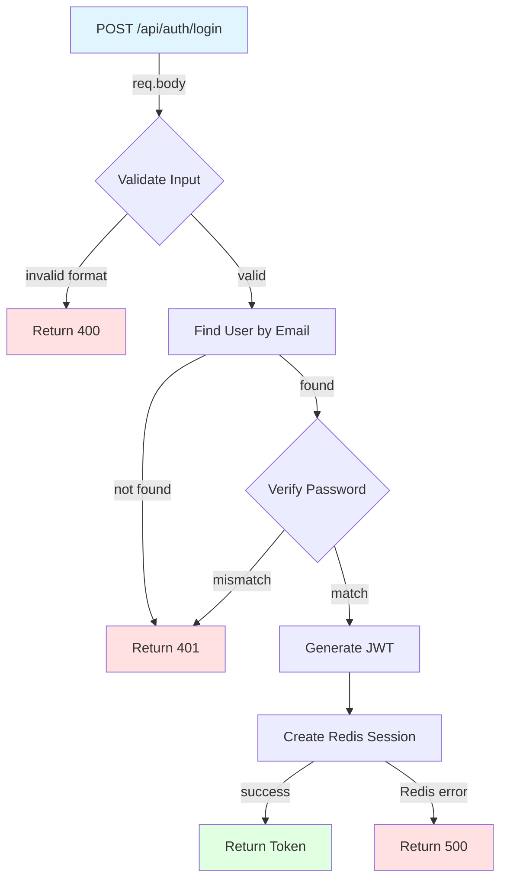
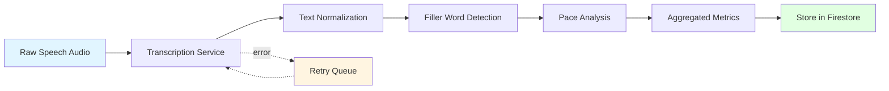
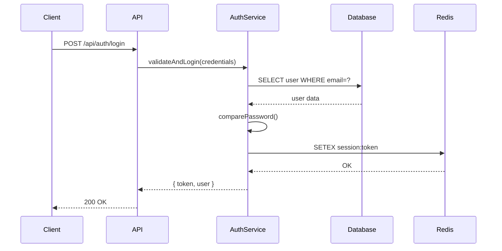
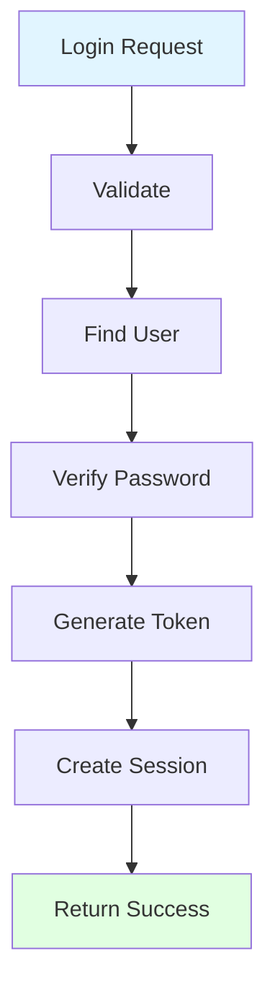
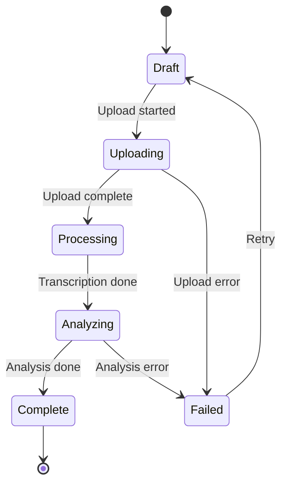
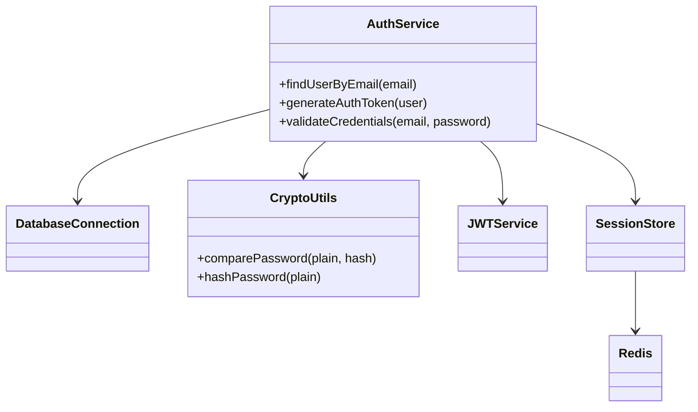

# Mermaid Diagram Examples for CodeMap

## When to Generate Diagrams

Generate Mermaid diagrams ONLY when user explicitly requests:
- "Create a mermaid graph"
- "Generate a diagram"
- "Visualize this flow"
- "Show me a diagram"

## 1. Flowchart - Execution Flow with Error Paths

**Usage notes:**
- `graph TD` = top-down flow
- `{}` for decision nodes (diamonds)
- `[]` for process nodes (rectangles)
- `|label|` for edge labels
- Color success endpoints green, errors red, entry blue

## 2. Flowchart - Data Pipeline

**Usage notes:**
- `graph LR` = left-right flow (good for pipelines)
- `-.->` for dashed lines (error paths, async)
- Yellow for queues/intermediate states

## 3. Sequence Diagram - Service Interaction

**Usage notes:**
- `->>` for synchronous calls
- `-->>` for returns
- `participant` declares actors
- Good for showing timing and interaction

## 4. Simplified Main-Path Only

**Usage notes:**
- Omit error paths for simplicity
- Focus on happy path only
- Useful for high-level overview

## 5. State Diagram - Speech Processing States

**Usage notes:**
- Good for state machines
- Shows valid transitions
- Helps understand lifecycle

## 6. Class Diagram - Service Relationships

**Usage notes:**
- Shows component dependencies
- Good for architecture overview
- Can include method signatures

## Template Selection Guide

| User Request | Diagram Type | Pattern |
|-------------|--------------|---------|
| "Show the flow" | Flowchart | Example 1 or 4 |
| "Include errors" | Flowchart with errors | Example 1 |
| "Data pipeline" | Left-right flowchart | Example 2 |
| "Service calls" | Sequence diagram | Example 3 |
| "Simplify" | Simple flowchart | Example 4 |
| "State machine" | State diagram | Example 5 |
| "Architecture" | Class diagram | Example 6 |

## After Generation

Always provide:
1. The Mermaid code block (renders in GitHub, many terminals)
2. Link to https://mermaid.live for editing
3. Offer to modify: "simplify", "add error paths", "show as sequence diagram"
